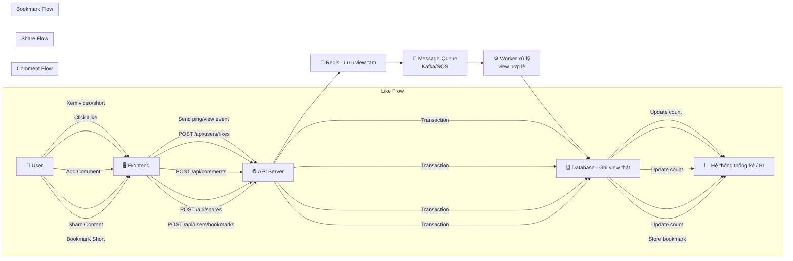

# Engagement System Flowchart & Documentation

## System Overview
The Reel platform implements a comprehensive engagement system that tracks user interactions with videos and shorts, including views, likes, comments, and shares. The system uses a multi-layered architecture to ensure scalability and real-time performance.

## Flowchart



## Database Schema

### Core Tables
- **`users`** - User profiles and statistics
- **`videos`** - Video content with engagement counts
- **`shorts`** - Short content with engagement counts

### Engagement Tables
- **`video_likes`** / **`short_likes`** - Like tracking
- **`video_comments`** / **`short_comments`** - Comment system with nested replies
- **`video_shares`** / **`short_shares`** - Share tracking by platform
- **`short_bookmarks`** - Bookmark system (shorts only)
- **`video_views`** / **`short_views`** - Detailed view analytics

## API Endpoints

### View Tracking
```http
POST /api/views/videos/{videoId}
POST /api/views/shorts/{shortId}
PUT /api/views/{viewId}
GET /api/views/videos/{videoId}
GET /api/views/shorts/{shortId}
GET /api/views/stats/{contentId}?type=video|short
GET /api/users/{userId}/views/history
```

### Like System
```http
POST /api/users/likes/videos
DELETE /api/users/likes/videos
POST /api/users/likes/shorts
DELETE /api/users/likes/shorts
GET /api/users/{userId}/likes/videos
GET /api/users/{userId}/likes/shorts
GET /api/users/likes/videos/check?userId={userId}&videoId={videoId}
GET /api/users/likes/shorts/check?userId={userId}&shortId={shortId}
```

### Comment System
```http
POST /api/comments/videos/{videoId}
DELETE /api/comments/{commentId}
PUT /api/comments/{commentId}
GET /api/comments/videos/{videoId}
POST /api/comments/shorts/{shortId}
DELETE /api/comments/{commentId}
PUT /api/comments/{commentId}
GET /api/comments/shorts/{shortId}
```

### Share System
```http
POST /api/shares/videos/{videoId}
POST /api/shares/shorts/{shortId}
GET /api/shares/videos/{videoId}
GET /api/shares/shorts/{shortId}
GET /api/users/{userId}/shares/videos
GET /api/users/{userId}/shares/shorts
GET /api/shares/stats/{contentId}?type=video|short
```

### Bookmark System (Shorts Only)
```http
POST /api/users/bookmarks/shorts
DELETE /api/users/bookmarks/shorts
GET /api/users/{userId}/bookmarks/shorts
GET /api/users/bookmarks/shorts/check?userId={userId}&shortId={shortId}
```

## View Tracking Architecture

### 1. Real-time View Tracking
```javascript
// Frontend implementation
const trackView = async (contentId, contentType) => {
  const sessionId = generateSessionId();
  
  // Initial view ping
  await fetch(`/api/views/${contentType}s/${contentId}`, {
    method: 'POST',
    headers: { 'Content-Type': 'application/json' },
    body: JSON.stringify({
      sessionId,
      userId: currentUser?.id,
      ipAddress: getClientIP(),
      userAgent: navigator.userAgent
    })
  });
  
  // Periodic updates during playback
  const updateInterval = setInterval(async () => {
    await fetch(`/api/views/${viewId}`, {
      method: 'PUT',
      headers: { 'Content-Type': 'application/json' },
      body: JSON.stringify({
        watchDuration: currentTime,
        isCompleted: currentTime >= duration * 0.8
      })
    });
  }, 5000);
};
```

### 2. Redis Caching Layer
```javascript
// Redis implementation for temporary view storage
const redisViewCache = {
  async addView(contentId, sessionId, data) {
    const key = `view:${contentId}:${sessionId}`;
    await redis.setex(key, 300, JSON.stringify(data)); // 5 minutes TTL
  },
  
  async getView(contentId, sessionId) {
    const key = `view:${contentId}:${sessionId}`;
    return await redis.get(key);
  }
};
```

### 3. Message Queue Processing
```javascript
// Worker implementation
const processViewQueue = async (message) => {
  const { contentId, contentType, sessionId, data } = message;
  
  // Validate view (prevent duplicates, check for bots, etc.)
  if (await isValidView(contentId, sessionId, data)) {
    // Update database
    await viewService.addView(contentId, contentType, data);
    
    // Update analytics
    await analyticsService.trackView(contentId, contentType, data);
  }
};
```

## Engagement Analytics

### View Analytics
- **Total Views**: Raw view count
- **Unique Views**: Views per unique session
- **Completed Views**: Views where user watched >80% of content
- **Average Watch Duration**: Mean viewing time
- **View Retention**: Percentage of users who continue watching

### Like Analytics
- **Like Rate**: Likes per view
- **Like Velocity**: Rate of likes over time
- **User Engagement**: Users who like vs. just view

### Comment Analytics
- **Comment Rate**: Comments per view
- **Reply Rate**: Replies per comment
- **Comment Sentiment**: Positive/negative comment analysis

### Share Analytics
- **Share Rate**: Shares per view
- **Platform Breakdown**: Shares by platform (Facebook, Twitter, etc.)
- **Viral Coefficient**: How many new views each share generates

## Performance Optimizations

### 1. Database Optimizations
- **Indexes**: On frequently queried fields (userId, contentId, createdAt)
- **Partitioning**: By date for large tables (views, likes)
- **Read Replicas**: For analytics queries

### 2. Caching Strategy
- **Redis**: Session data, temporary view counts
- **CDN**: Static content, thumbnails
- **Application Cache**: Frequently accessed user data

### 3. Queue Processing
- **Async Processing**: Non-critical operations (analytics, notifications)
- **Batch Processing**: Bulk updates for performance
- **Dead Letter Queues**: Failed message handling

## Security Considerations

### 1. Rate Limiting
```javascript
// Rate limiting for engagement actions
const rateLimiter = {
  likes: { max: 100, window: '1h' },
  comments: { max: 50, window: '1h' },
  shares: { max: 20, window: '1h' },
  views: { max: 1000, window: '1h' }
};
```

### 2. Bot Detection
- **Session Validation**: Prevent fake views
- **IP Analysis**: Detect suspicious patterns
- **User Agent Analysis**: Identify automated requests

### 3. Content Moderation
- **Comment Filtering**: Remove inappropriate content
- **Spam Detection**: Prevent comment spam
- **User Reporting**: Allow users to report abuse

## Monitoring & Alerting

### 1. Key Metrics
- **Engagement Rate**: (Likes + Comments + Shares) / Views
- **View-to-Completion Rate**: Completed Views / Total Views
- **User Retention**: Users who return after first view

### 2. Alerts
- **High Error Rates**: API failures, database issues
- **Performance Degradation**: Slow response times
- **Unusual Activity**: Sudden spikes in engagement

### 3. Dashboards
- **Real-time Analytics**: Live engagement metrics
- **User Behavior**: Individual user engagement patterns
- **Content Performance**: Top performing videos/shorts

## Implementation Timeline

### Phase 1: Core Engagement (Week 1-2)
- [x] Database schema design
- [x] Basic like/unlike functionality
- [x] Comment system (CRUD operations)
- [x] Share tracking

### Phase 2: View Analytics (Week 3-4)
- [x] View tracking system
- [x] Session management
- [x] Basic analytics
- [x] Performance optimizations

### Phase 3: Advanced Features (Week 5-6)
- [ ] Bookmark system
- [ ] Nested comments
- [ ] Advanced analytics
- [ ] Real-time notifications

### Phase 4: Optimization (Week 7-8)
- [ ] Caching implementation
- [ ] Queue processing
- [ ] Security hardening
- [ ] Performance tuning

## Future Enhancements

### 1. AI-Powered Features
- **Content Recommendations**: Based on engagement patterns
- **Sentiment Analysis**: Comment sentiment tracking
- **Trend Prediction**: Predict viral content

### 2. Social Features
- **User Mentions**: @username in comments
- **Hashtag Support**: #trending topics
- **Collaborative Playlists**: Shared content collections

### 3. Monetization
- **Engagement Rewards**: Points for likes/comments/shares
- **Premium Features**: Advanced analytics for creators
- **Sponsored Content**: Promoted posts based on engagement

This comprehensive engagement system provides a solid foundation for building a successful video platform with rich user interactions and detailed analytics. 